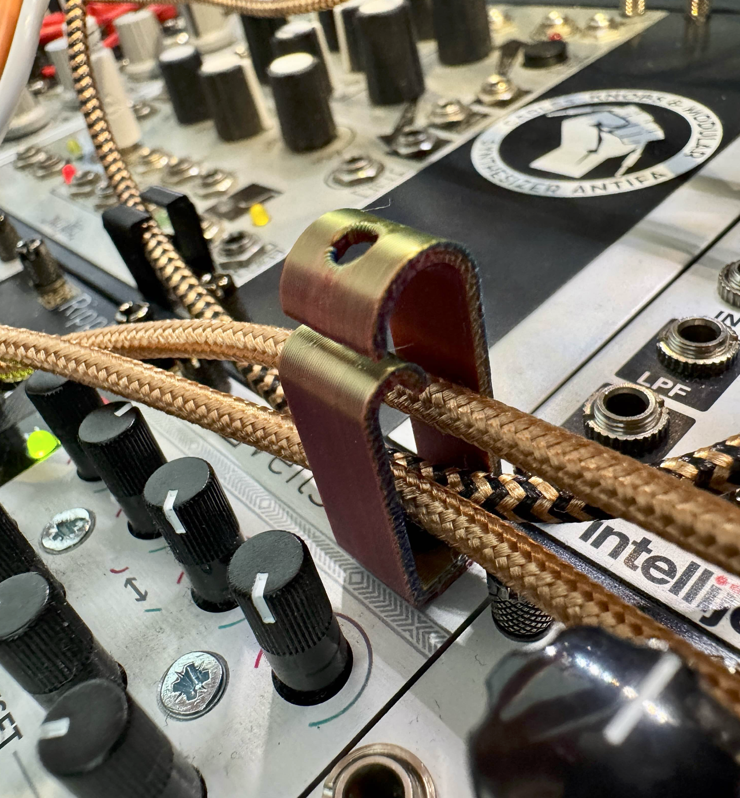

# 3D printable eurorack cable clips
A little cable clip to use instead of a regular knurlie or panel screw. You'll need a M3x10mm bolt, slightly longer than your usual ones.

I'd love to see your creations! Tag me on Instagram or send me a photo to add here.
Check out my music on [YouTube](https://www.youtube.com/finnglink) or [Instagram](https://www.instagram.com/glnnk.art).
You can [Buy me a coffee](https://www.paypal.com/paypalme/finnglink) if you've found my work helpful :)

Copy my [Onshape file](https://cad.onshape.com/documents/0c15823d7a9c58d96dd2e84d/w/f5060bd6fa143ed86d25eabe/e/6a3c16a17e23639f29413637?renderMode=0&uiState=67a1d1b0c68fbd0b8535718e) 
to modify it to your needs. **Disclaimer: Unless you're on an Onshape plan other than free, you can't use this design commercially.
If you're planning to sell these in large quantities, please donate a part of your proceeds to a good cause. I'll also appreciate a little [Thank you :)](https://www.paypal.com/paypalme/finnglink)

